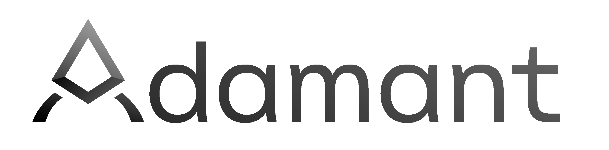

*A component-based, model-driven framework for constructing reliable and reusable real-time software*
#

**Adamant** is a framework that enables efficient design, implementation, and test of embedded real-time software. Adamant was first developed for spacecraft flight software at the [Laboratory for Atmospheric and Space Physics (LASP)](https://lasp.colorado.edu/) at the University of Colorado, Boulder, and is now available for use under the Apache-2.0 [license](LICENSE). 

Adamant was created to solve two problems:

 1. Provide a technical solution that addresses the unique challenges of spacecraft flight software, with a focus on performance
 2. Allow for direct, verbatim code reuse from project to project to reduce development costs and increase reliability

The framework is used by first creating a model of the software in [YAML](https://yaml.org/)-based domain specific language. This model defines a set of components and describes how they are connected together. 

 

This model is used to generate the structural code, documentation, unit test scaffolding, and command & telemetry interface for the system. Developers are then left the task of defining the system behavior via handwritten Ada.

## What is Included

 * A model-based architecture that divides software into separate components with strongly-typed interfaces
 * Generators which can produce code, diagrams, and documentation from these models
 * A platform agnostic, multi-tasking, high performance, embedded real-time software core written in Ada that adheres to the [Ravenscar Profile](https://en.wikipedia.org/wiki/Ravenscar_profile)
 * Support for compiling and proving [SPARK](https://learn.adacore.com/courses/intro-to-spark/chapters/01_Overview.html#what-is-it) (a formally provable subset of Ada)
 * A growing library of ready-to-use [components](src/components)
 * An [AUnit](https://docs.adacore.com/live/wave/aunit/html/aunit_cb/aunit_cb.html)-based component test framework
 * Tooling for test coverage, coding style checks, code metrics, and more

## Getting Started

The best way to get started with Adamant is to try out the [Example Project](https://github.com/lasp/adamant_example). The example demonstrates a functioning deployment of Adamant that runs on both Linux and an embedded [Raspberry Pi Pico](https://www.raspberrypi.com/products/raspberry-pi-pico/) target. The example also provides a docker-based build environment that contains all the dependencies needed for working with Adamant. You are encouraged to clone the example project and begin modifying it to meet your needs.

If you want to create your own project from scratch, it is best to start by bringing up the provided [Docker environment](https://github.com/lasp/adamant/tree/main/docker), which comes with Adamant's dependencies pre-installed. From here, you can build and run things within Adamant and then start building out your own project that uses it.

Want to read more first? See the [Architecture Description Document](doc/architecture_description_document/architecture_description_document.pdf) and [User Guide](doc/user_guide/user_guide.pdf).

## Need Help?

 * Have a question or suggestion? Please use the project's [discussions](https://github.com/lasp/adamant/discussions).
 * Find a bug? Please [submit an issue](https://github.com/lasp/adamant/issues).

## Contributing

Want to make Adamant better? For details on how to contribute, read [CONTRIBUTING.md](CONTRIBUTING.md).

## Resources

Below are some helpful resources for learning up on Adamant and the various tools used in this framework.

 * The [Architecture Description Document](doc/architecture_description_document/architecture_description_document.pdf) provides an overview of Adamant's architecture and main concepts.
 * The [User Guide](doc/user_guide/user_guide.pdf) is a comprehensive resource for developers looking to start using the Adamant framework.
 * Check out the [Example Project](https://github.com/lasp/adamant_example) to explore Adamant in action.
 * New to Ada or SPARK? Learn more [here](https://learn.adacore.com/). But familiar with C++ or Java? Take a look at [this guide](https://learn.adacore.com/courses/Ada_For_The_CPP_Java_Developer/index.html).
 * Learn more about Adamant's [redo](https://github.com/dinkelk/redo)-based build system.

## Directory Structure

 * `config/` - configuration files for tuning the Adamant framework to fit a specific project
 * `doc/` - documentation explaining the design and use of the framework
 * `docker/` - a Docker environment provided for Adamant
 * `env/` - files used for configuring and installing the development environment used by the framework
 * `gen/` - the generator system for generating Ada source files, Latex & HTML documentation, and more
 * `gnd/` - ground-based software tools and utilities
 * `redo/` - the framework's [redo](https://github.com/dinkelk/redo)-based build system
 * `src/` - the reusable source code which makes up the framework
